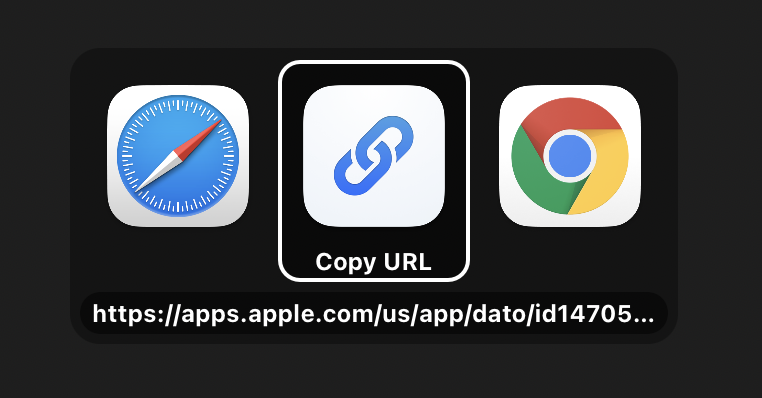

	
	<h1>Copy URL</h1>
	

		<b>Adds copy functionality to browser picker apps</b>
	

	 
	 
	 

The app copies the URL passed to it and then quits. It also registers itself as a browser.

The use-case is being able to quickly copy a URL by clicking it when using a “browser picker” app, like [Choosy](https://www.choosyosx.com). Since the app registers itself as a browser, it will show up as a browser in Choosy, and when selected, copies the URL to the clipboard.

## Download

[**Latest release.**](https://github.com/sindresorhus/Copy-URL/releases/latest)

Requires macOS 11 or later.

## Browser pickers

- [Choosy](https://www.choosyosx.com)
- [Open With Pro](https://apps.apple.com/app/id1530712347?mt=12)

## Links

- [My other apps](https://sindresorhus.com/apps)
